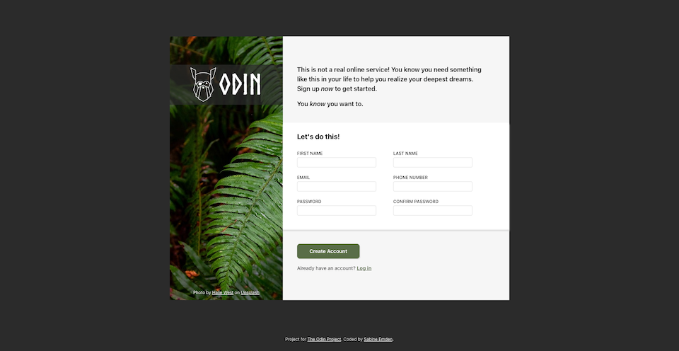

# The Odin Project - Sign-up form solution

This is a solution to [Project: Sign-up Form for the Odin Project](https://www.theodinproject.com/lessons/node-path-intermediate-html-and-css-sign-up-form). The Odin Project provides a free open-source coding curriculum that can be taken entirely online.

Project: Calculator is one of two projects in the [Intermediate HTML and CSS Course](https://www.theodinproject.com/paths/full-stack-javascript/courses/intermediate-html-and-css). It provides an opportunity to practice the content that was covered in the course sections _Intermediate HTML Concepts_, _Intermediate CSS Concepts_, and _Forms_.

## Table of contents

- [Overview](#overview)
  - [Screenshot](#screenshot)
  - [Links](#links)
- [My process](#my-process)
  - [Built with](#built-with)
  - [What I learned](#what-i-learned)
  - [Continued development](#continued-development)
  - [Useful resources](#useful-resources)
- [Author](#author)
- [Acknowledgments](#acknowledgments)

## Overview

### Screenshot

### Links

- [GitHub repository](https://github.com/SabineEmden/odin-sign-up-form)
- [Live site](https://sabineemden.github.io/odin-sign-up-form/)

## My process

### Build with

- Semantic HTML5 markup
- CSS custom properties
- CSS flexbox

### What I learned

Three things in this solution that I had not used in projects before are:

- HTML5 input types
- Styling forms
- System font stack

Other features that were covered the course sections _Intermediate HTML Concepts_, _Intermediate CSS Concepts_, and _Forms_ and that I used in my solution are:

- CSS reset
- Relative units
- Self-hosted fonts
- Text styles
- Background image
- Box shadow
- Pseudo-classes
- Custom properties

### Continued development

For my solution, I only used HTML and CSS features that were covered in the curriculum of the [Full Stack JavaScript learning path](https://www.theodinproject.com/paths/full-stack-javascript) up to this project.

CSS grid is covered in the next section after this project. The layout in the design file for this project would be a good candidate for Layout First Design and CSS grid.

Responsive design is not covered until much later in the curriculum. I tried to make my solution as responsive as possible with the tools I had available, using CSS flexbox but no media queries.

Web accessibility is also covered much later in the curriculum. I used what I have learned about accessibility while working on [Frontend Mentor challenges](https://www.frontendmentor.io/).

Validating that the password fields match each other requires JavaScript. Using JavaScript for form validation is covered in a future lesson. My solution contains only the client-site validation for the email address.

The form has no backend and doesn't send the submitted data anywhere.

### Useful resources

- [These font stacks will improve your site performance](https://www.youtube.com/watch?v=VOd6jfAImV4) by Kevin Powell - This video gives a good introduction to the System UI font stack.

## Author

Find me online:

- Mastodon - [@sabineemden](https://mastodon.online/@sabineemden)

## Acknowledgements

In addition to the system font stack, this solution uses the font [Norse Bold](https://www.joelcarrouche.com/fonts/norse) by Joël Carrouché. The font is free for personal and commercial use and includes a complete runic alphabet with unicode support.

This solution also uses Josh Comeau's [CSS reset](https://www.joshwcomeau.com/css/custom-css-reset/) and the [Almost Black & White Color Scheme](https://www.schemecolor.com/almost-black-white.php).
